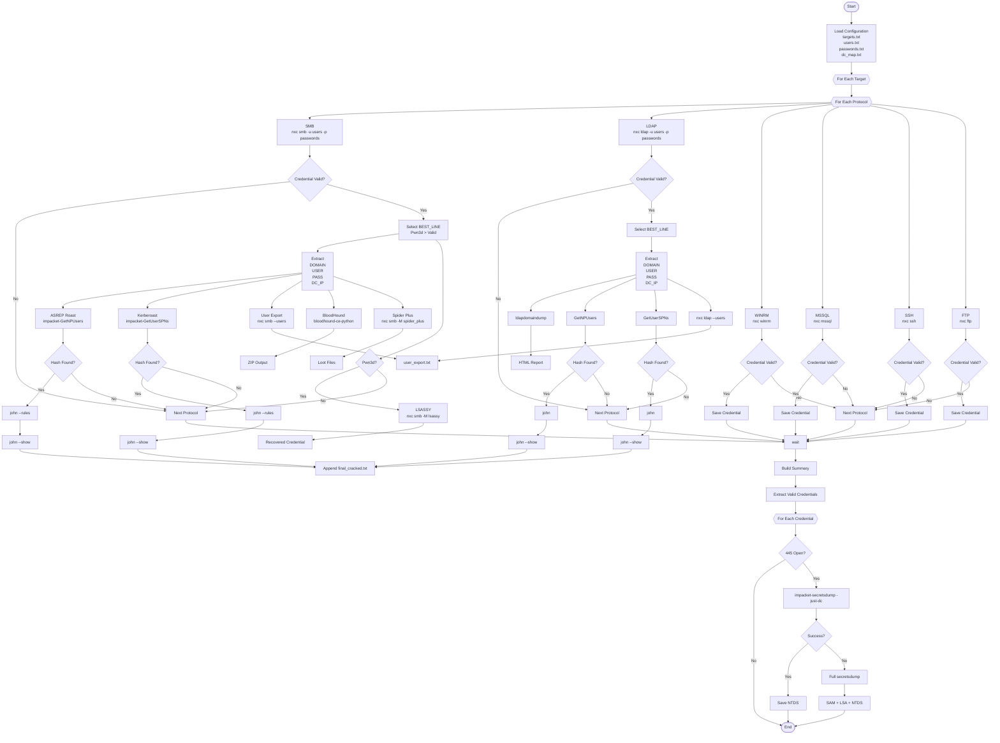

# Workflow

```mermaid
flowchart TD

A([Start])
--> B[Load Configuration<br/>targets.txt<br/>users.txt<br/>passwords.txt<br/>dc_map.txt]
--> C{{For Each Target}}
--> D{{For Each Protocol}}

D --> SMB
D --> LDAP
D --> WINRM
D --> MSSQL
D --> SSH
D --> FTP

%% ===================== SMB =====================

SMB["SMB<br/>nxc smb -u users -p passwords"]
--> SMBAUTH{Credential Valid?}

SMBAUTH -- No --> NEXT1[Next Protocol]

SMBAUTH -- Yes --> SMBBEST["Select BEST_LINE<br/>Pwn3d > Valid"]
--> SMBINFO["Extract<br/>DOMAIN<br/>USER<br/>PASS<br/>DC_IP"]

SMBINFO --> ASREP
SMBINFO --> KERB
SMBINFO --> USEREXP
SMBINFO --> BLOOD
SMBINFO --> SPIDER

SMBBEST --> PWN{Pwn3d?}
PWN -- Yes --> LSASS
PWN -- No --> NEXT1

ASREP["ASREP Roast<br/>impacket-GetNPUsers"]
--> ASREPHASH{Hash Found?}

ASREPHASH -- Yes --> ASREPJOHN["john --rules"]
--> ASREPSHOW["john --show"]
--> CRACKED["Append final_cracked.txt"]

ASREPHASH -- No --> NEXT1

KERB["Kerberoast<br/>impacket-GetUserSPNs"]
--> KERBHASH{Hash Found?}

KERBHASH -- Yes --> KERBJOHN["john --rules"]
--> KERBSHOW["john --show"]
--> CRACKED

KERBHASH -- No --> NEXT1

USEREXP["User Export<br/>nxc smb --users"]
--> USERLIST["user_export.txt"]

SPIDER["Spider Plus<br/>nxc smb -M spider_plus"]
--> LOOT["Loot Files"]

BLOOD["BloodHound<br/>bloodhound-ce-python"]
--> ZIP["ZIP Output"]

LSASS["LSASSY<br/>nxc smb -M lsassy"]
--> CREDS["Recovered Credential"]

%% ===================== LDAP =====================

LDAP["LDAP<br/>nxc ldap -u users -p passwords"]
--> LDAPAUTH{Credential Valid?}

LDAPAUTH -- No --> NEXT2[Next Protocol]

LDAPAUTH -- Yes --> LDAPBEST["Select BEST_LINE"]
--> LDAPINFO["Extract<br/>DOMAIN<br/>USER<br/>PASS<br/>DC_IP"]

LDAPINFO --> LDAPDUMP
LDAPINFO --> LDAPASREP
LDAPINFO --> LDAPKERB
LDAPINFO --> LDAPUSER

LDAPDUMP["ldapdomaindump"]
--> HTML["HTML Report"]

LDAPASREP["GetNPUsers"]
--> LDAPASREPHASH{Hash Found?}

LDAPASREPHASH -- Yes --> LDAPJOHN["john"]
--> LDAPSHOW["john --show"]
--> CRACKED

LDAPASREPHASH -- No --> NEXT2

LDAPKERB["GetUserSPNs"]
--> LDAPKERBHASH{Hash Found?}

LDAPKERBHASH -- Yes --> LDAPKERBJOHN["john"]
--> LDAPKERBSHOW["john --show"]
--> CRACKED

LDAPKERBHASH -- No --> NEXT2

LDAPUSER["nxc ldap --users"]
--> USERLIST

%% ===================== OTHER =====================

WINRM["WINRM<br/>nxc winrm"]
--> WOK{Credential Valid?}
WOK -- Yes --> SAVE1["Save Credential"]
WOK -- No --> NEXT3[Next Protocol]

MSSQL["MSSQL<br/>nxc mssql"]
--> MOK{Credential Valid?}
MOK -- Yes --> SAVE2["Save Credential"]
MOK -- No --> NEXT3

SSH["SSH<br/>nxc ssh"]
--> SOK{Credential Valid?}
SOK -- Yes --> SAVE3["Save Credential"]
SOK -- No --> NEXT3

FTP["FTP<br/>nxc ftp"]
--> FOK{Credential Valid?}
FOK -- Yes --> SAVE4["Save Credential"]
FOK -- No --> NEXT3

%% ===================== FINAL =====================

NEXT1 --> WAIT
NEXT2 --> WAIT
NEXT3 --> WAIT
SAVE1 --> WAIT
SAVE2 --> WAIT
SAVE3 --> WAIT
SAVE4 --> WAIT

WAIT["wait"]
--> SUMMARY["Build Summary"]
--> VALID["Extract Valid Credentials"]
--> LOOP{{For Each Credential}}

LOOP
--> CHECK445{445 Open?}

CHECK445 -- No --> END

CHECK445 -- Yes --> DUMP["impacket-secretsdump -just-dc"]

DUMP --> OK{Success?}

OK -- Yes --> NTDS["Save NTDS"]

OK -- No --> FULL["Full secretsdump"]

FULL --> SAM["SAM + LSA + NTDS"]

NTDS --> END([End])
SAM --> END
```
